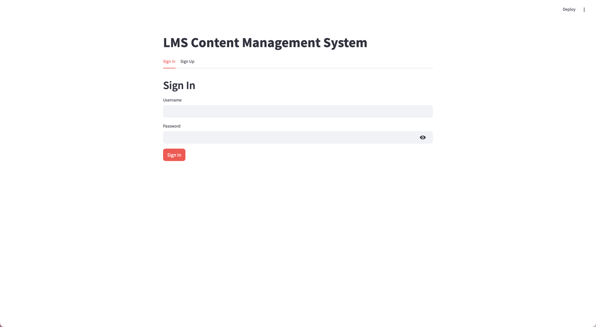

# TermProject 12

A Python-based educational project for managing users, courses, and collections using a MySQL database. This project demonstrates user authentication, course management, and file tracking, and is designed for learning and experimentation.

## Features
- User registration and authentication
- Course management
- File and discussion URL tracking
- MySQL database integration
- Environment variable configuration with dotenv
- Automatic database schema reset on each run (for development/testing)

## Application Screenshots

### Sign In Page


### LMS Content Processing


### Courses Overview


### File Processing Example


### Study Agent Interface


### Reminder Agent Interface


### ChatBot Agent Interface


## Requirements
- Python 3.7+
- MySQL server
- pip (Python package manager)

Python dependencies are listed in `requirements.txt` and include:
- `mysql-connector-python`
- `python-dotenv`

## Setup Instructions

### 1. Clone the Repository
```sh
git clone https://github.com/<your-username>/<your-repo>.git
cd TermProject\ 12
```

### 2. Install Python Dependencies
```sh
pip install -r requirements.txt
```

### 3. Set Up MySQL
- Ensure MySQL server is running.
- Create a user and grant privileges, or use your root credentials.
- The database and tables will be created automatically by the script.

### 4. Configure Environment Variables
Create a `.env` file in the project directory with the following content:
```
MYSQL_USER=your_mysql_user
MYSQL_PASSWORD=your_mysql_password
MYSQL_HOST=localhost
MYSQL_DATABASE=user_course_db
MOODLE_USER_KEY=your_moodle_key
MOODLE_USER_ID=your_moodle_id
MOODLE_USER_KEY2=your_moodle_key2
MOODLE_USER_ID2=your_moodle_id2
```

### 5. Run the Database Setup Script
```sh
python login_database.py
```
This will create/reset the database schema and insert example users.

## Usage
- The script will drop and recreate all tables on each run (for development/testing).
- Modify or extend the code for your own experiments.

## Troubleshooting
- **Access denied**: Check your MySQL credentials in `.env`.
- **Database does not exist**: The script will attempt to create it, but ensure your MySQL user has privileges.
- **Foreign key errors**: The script drops tables in the correct order to avoid these.
- **.env not loaded**: Ensure you have a `.env` file in the project root.

## Contributing
Contributions are welcome! Please fork the repository and submit a pull request. For major changes, open an issue first to discuss what you would like to change.

## License
This project is licensed under the MIT License. See the LICENSE file for details. 